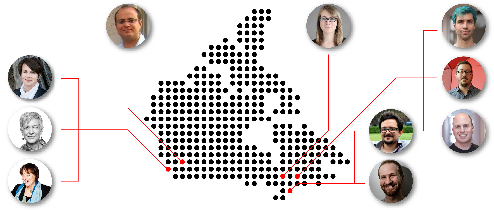
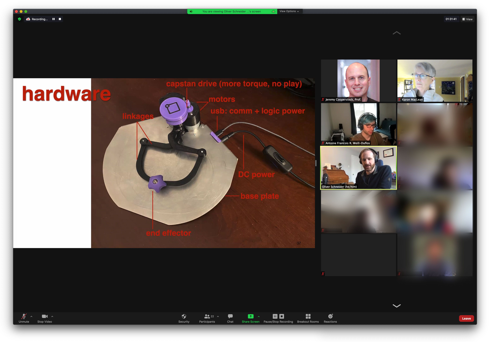

# Welcome to CanHaptics!

The CanHaptics network is a collective of researchers, industry practitioners, and community stakeholders across Canada. We make technology more human by making it physical - pushing out from the screen to be graspable, holdable, and engage with all of your senses - and do so by putting people, not technology, first.

# Who are we?
Driven by researchers from six universities across Canada (and growing!), we are HCI researchers and technologists dedicated to helping people through physical interactive technology like haptics, virtual reality, wearables, and more.

- British Columbia
  - [Dr. Karon MacLean](http://cs.ubc.ca/~maclean), The University of British Columbia (Vancouver), leader of the [SPIN Lab](https://www.cs.ubc.ca/labs/spin/frontpage)
  - [Dr. Rebecca Todd](https://psych.ubc.ca/profile/rebecca-todd/), The University of British Columbia (Vancouver), leader of the [Motivated Cognition Lab](https://mclab.psych.ubc.ca/)
  - [Dr. Pourang Irani](http://www.cs.umanitoba.ca/~irani/), The University of British Columbia (Okanagan), previously University of Manitoba
  - [Dr. Alissa N. Antle](https://www.sfu.ca/siat/people/research-faculty/alissa-antle.html), Simon Fraser University, director of the [TECI Lab](http://antle.iat.sfu.ca/).
- Ontario
  - [Dr. Oliver Schneider](http://oliverschneider.ca), University of Waterloo, leader of the [Haptic Experience Lab](https://uwaterloo.ca/haptic-experience-lab/)
  - [Dr. Arash Arami](https://www.aramilab.com/), University of Waterloo, leader of the [Arami Research Lab](https://www.aramilab.com/) on neuromechanics and assistive robotics
  - [Dr. Audrey Girouard](https://carleton.ca/scs/people/audrey-girouard/), Carleton University, leader of the [Creative Interactions Lab](https://cil.csit.carleton.ca/)
- Québec
  - [Dr. Jeremy Cooperstock](https://www.cim.mcgill.ca/~jer/), McGill University, leader of the [Shared Reality Lab](http://srl.mcgill.ca/)
  - [Dr. Vincent Lévesque](https://vlevesque.com/), École de Technologie Supérieure, leader of the Haptic User Experience (HUX) Lab
  - [Dr. Antoine Weill-Duflos](http://srl.mcgill.ca/~antoinew/), Haply Robotics

# What does CanHaptics do?

CanHaptics connects people through several programs (currently in development):
 - [CanHap501](http://ch501.canhaptics.ca): a cross-institutional graduate course on haptic information design
 - CanHap Seminar series: a ~monthly seminar series featuring researchers from all areas of haptics
 - The CanHap Slack group, with members from all course alumni and research lab members

# Course
[CanHap501](http://ch501.canhaptics.ca) is a graduate-level introduction to the inception, creation and evaluation of haptic and multimodal human-computer interfaces, designed to be accessible to different disciplines. It covers perceptual and attentional foundations, and emphasizes control and/or display of computed sensations and environments through haptic devices to user's sense of touch for the purpose of hapticcommunication -- for example,  signalling, social and affective touch, and sharing of control between human and a smart system. 

### Format
CanHap501 is delivered fully online in Canadian timezones, with a centerpiece team project carried out by cross-institutional teams. The course consists of lectures, assignments and labs, reading and discussion of current literature; culminating in a team project. Labs and projects employ a haptic force-feedback device made available to enrolled students for use at home or their local lab. 

More information at the course wiki: [https://ch501.canhaptics.ca/](https://ch501.canhaptics.ca/).

### Terms offered

 - Winter 2023
 - [Winter 2022](https://ch501.canhaptics.ca/en/2021_22) (authentication required) - 13 students
 - [Winter 2021](https://ch501.canhaptics.ca/) - 17 students

### Publications

 - K. E. MacLean, O. Schneider, A. Weill--Duflos, V. Levesque, P. Irani and J. R. Cooperstock, [CanHap 501: Learning Haptic UX Design in Remote Teams](https://ieeexplore.ieee.org/abstract/document/9517152), 2021 IEEE World Haptics Conference (WHC), 2021, pp. 348-348, doi: 10.1109/WHC49131.2021.9517152

## Seminar Series
The CanHap group offers seminar series when CH501 is not in session.

### Summer/fall 2022

Coming soon!

### Summer 2021

| Date        | Time  | Event           | 
| ------------- | ------------ | ------------ |
| Wednesday, June 16, 2021      | 1:00-2:00ET / noon-1pm CT / 10-11am PT | [Haptic Computing Lab](https://uwaterloo.ca/haptic-computing-lab/) Tour |
| Wednesday, June 23, 2021      | 1:00-2:00ET / noon-1pm CT / 10-11am PT | Manitoba HCI Lab Tour |
| Wednesday, July 21, 2021      | 1:00-2:00ET / noon-1pm CT / 10-11am PT | [Shared Reality Lab](http://srl.mcgill.ca/) Tour |
| Wednesday, Aug 4, 2021        | 1:00-2:00ET / noon-1pm CT / 10-11am PT | Haptic User Experience (HUX) Lab Tour |
| Wednesday, Aug 18, 2021       | 1:00-2:00ET / noon-1pm CT / 10-11am PT | [SPIN Lab](https://www.cs.ubc.ca/labs/spin/frontpage) Tour |

# Our commitments

**Canada:** the CanHaptics network will accelerate research and innovation in haptics, further entrenching Canada as a leader in interactive physical technology, and attract and retain top technology and design talent and companies to Canada.

**Industry:** the CanHaptics network will provide companies with a pipeline for talent and connect industry practitioners to cutting-edge research to enhance their technology and designs, by grounding research with real needs of real people.

**Community partners:** the CanHaptics network will connect community partners with researchers and industry partners to tackle real social problems that matter to people. This ensures that our research projects translate into action; impacting communities and building positive relationships. , build relationships between these communities, and help translate research projects into impact for their communities.

**Researchers:** the CanHaptics network will establish a tighter research community in Canada, streamlining collaboration across space (connecting researchers at different institutions), time (improving institutional knowledge and training across generations of students), and communities (connecting researchers with industry and community partners).

# Get involved!
If you are interested in becoming an industry or community member, contact any of the lead investigators above.

## Attributions

Map image adapted from [https://freevectormaps.com/canada/CA-EPS-01-3001?ref=atr.](https://freevectormaps.com/canada/CA-EPS-01-3001?ref=atr.)
